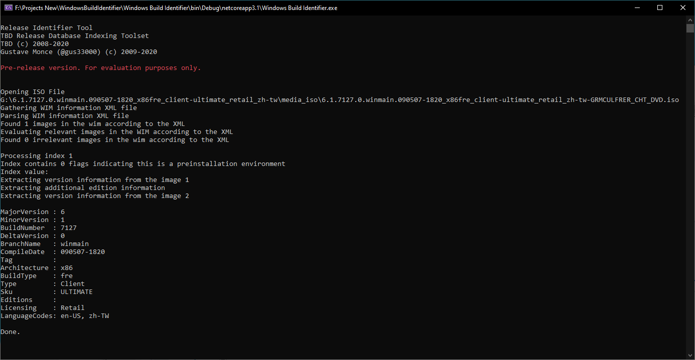

# Windows Build Identifier



This tool aims to identify windows builds properly from various types of distribution medium.

## License

This tool is released under the MIT license. For more information see:
```LICENSE.md```

---

This tool uses code from https://github.com/adoconnection/SevenZipExtractor

See LICENSE under:
```Windows Build identifier\SevenZipExtractor\LICENSE```
for more information about licensing.

---

This tool uses code from https://github.com/DiscUtils/DiscUtils

See LICENSE under:
```DiscUtilsLibrary\LICENSE.txt```
for more information about licensing.
